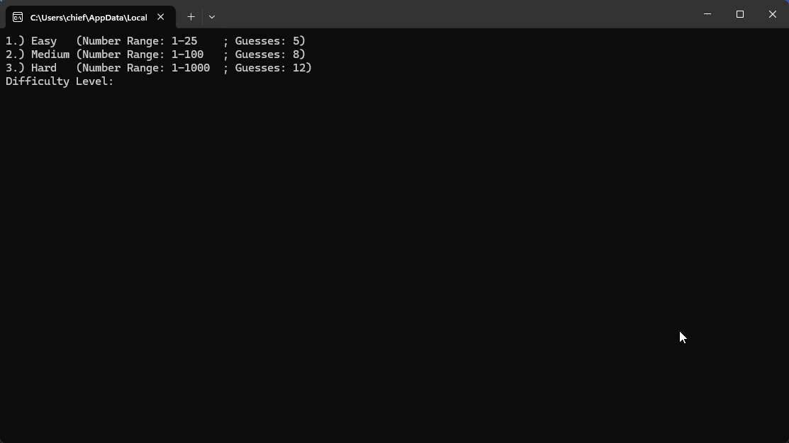

# 🎯 Guess My Number (Python)

A fun and interactive number guessing game written in Python!  
Choose a difficulty level and try to guess the secret number before you run out of attempts.

## 💡 Features

- Three difficulty levels:
  - **Easy**: 1–25 range, 5 guesses
  - **Medium**: 1–100 range, 8 guesses
  - **Hard**: 1–1000 range, 12 guesses
- Random number generation
- Input validation with helpful feedback
- Hints whether your guess is too high or too low

## ▶️ How to Run

1. Open the `.sln` (Visual Studio Solution) file in **Microsoft Visual Studio**
2. Press `Ctrl + F5` or click **Run** to execute the program

## Demo Output

## 🧠 Educational Focus

This project helps reinforce:
- Conditional logic (`if`, `elif`, `else`)
- Functions and parameter passing
- Looping with `for`
- Input validation
- Random number generation using `random.randint()`

---

Have fun guessing — and don't forget to pick the right difficulty 😉
